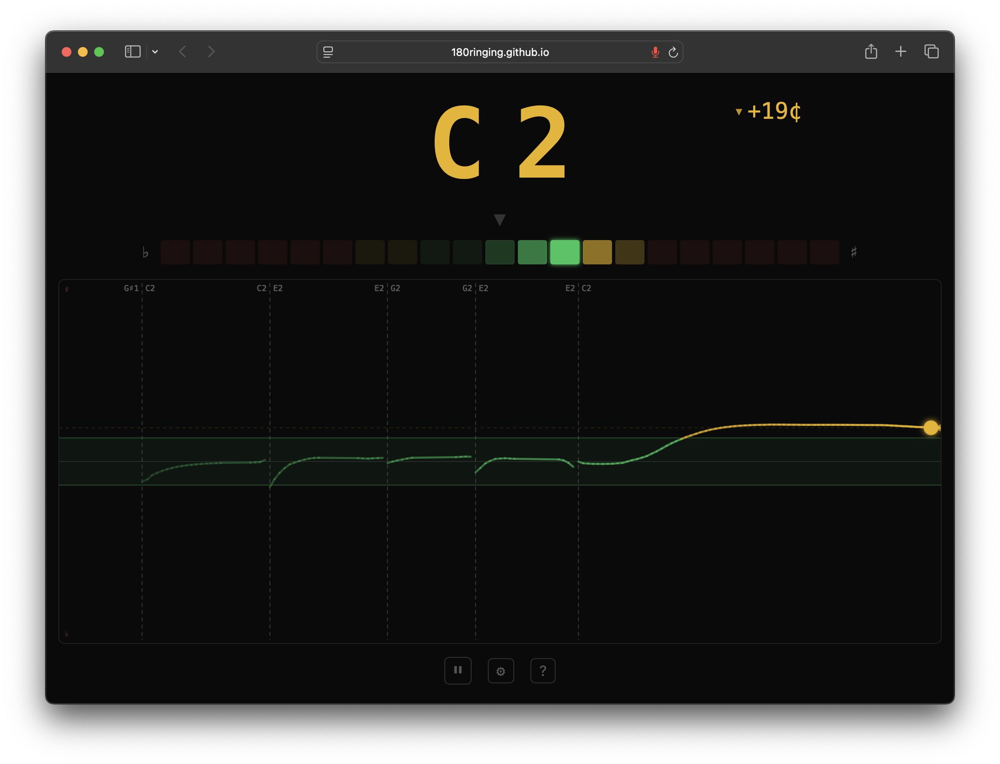

# 🎸 Contrabass Tuner

> **🇬🇧 [English version](README.md)**

Браузерный хроматический тюнер, оптимизированный для контрабаса. Один HTML-файл, работает в любом современном браузере, на весь экран — чтобы было видно издалека во время занятий.

**[▶ Открыть тюнер](https://180ringing.github.io/contrabass-tuner/)** — работает прямо в браузере, ничего устанавливать не нужно.



## Зачем

Я играю на бас-гитаре и учусь играть на контрабасе. На безладовом инструменте нет ориентиров — нужно учиться интонировать на слух. Обычные тюнеры показывают только текущее отклонение, а мне хотелось видеть *историю* — как стабильно я держу ноту и что происходит при переходах. Потом увлёкся и решил сделать тюнер своей мечты.

Веб-страница — самое простое решение: один файл, открыл в браузере на ноутбуке во весь экран, и видно от контрабаса через всю комнату.

## Возможности

- **Lane-дисплей** — график высоты тона в реальном времени. Зелёный коридор = попал. Показывает стабильность интонации за последние секунды
- **LED-шкала** — мгновенный индикатор отклонения, как на аппаратном тюнере
- **Детекция атаки** — бланкинг шумного транзиента при щипке (pizzicato)
- **Octave lock** — фиксирует октаву между щипками, борется с прыжками G1↔G2 из-за гармоник
- **Lowpass-фильтр** — ослабляет верхние гармоники, помогая детектору найти фундаментал
- **Spectral flatness** — отличает ноту от шума по форме спектра
- **Адаптивный RMS gate** — отсекает фоновый шум, но дослушивает хвост ноты
- **Двуязычный интерфейс** — английский и русский, автоопределение по локали браузера
- **Сохранение настроек** — всё хранится в localStorage

## Быстрый старт

**Вариант 1: Онлайн** — откройте [живую версию](https://180ringing.github.io/contrabass-tuner/)

**Вариант 2: Локально** — скачайте `index.html` и откройте в браузере. Для первой загрузки нужен интернет (библиотека pitchy с CDN).

Требуется доступ к микрофону. Работает в Chrome, Firefox, Edge (десктоп и мобильные). Safari поддерживается.

## Путь сигнала

```
Микрофон
  │
  ▼
Lowpass Filter ─────────── lowpassFreq: 350 Гц
  │                        Ослабляет верхние гармоники
  ▼
AnalyserNode ──────────── bufferSize: 4096 (~93 мс)
  │
  ├─ волна (inputBuffer)
  │    │
  │    ▼
  │  [1] Attack Detection ─ attackRmsRatio: 3.0
  │    │                     attackBlankMs: 120
  │    │                     + сброс octave lock
  │    ▼
  │  [2] RMS Gate ────────── rmsGateHigh / rmsGateLow
  │    │                     rmsGateRelease: 0.9985
  │    ▼
  ├─ спектр (freqBuffer)
  │    │
  │    ▼
  │  [3] Spectral Gate ──── spectralThreshold: 0.25
  │    │                     0=тон, 1=шум
  │    ▼
  │  [4] Pitch Detection ── clarityThreshold: 0.92
  │    │  (pitchy MPM)       minFrequency / maxFrequency
  │    ▼
  │  [5] Median Filter ──── medianWindow: 7
  │    │  (на Гц)
  │    ▼
  │  [6] Octave Lock ────── octaveLockEnabled
  │    │  snap ×2/×0.5
  │    ▼
  │  [7] Freq → Note+Cents
  │    │
  │    ▼
  │  [8] Note Change Detection
  │    │
  │    ▼
  │  [9] EMA Filter ─────── smoothingAlpha: 0.15
  │    │  (на центах)
  │    ▼
  ├────┼────────────┐
  ▼    ▼            ▼
Нота  LED-шкала   Lane (canvas)
±¢    21 сегм.    trail + коридор
▸ ◂   + метка     greenZoneCents: 13
                  trailDurationSec: 3
```

## Настройки

Основные настройки вынесены ползунками. Тонкая настройка — в инженерном меню (нажмите «Инженерные параметры» в настройках).

Все настройки сохраняются автоматически между сессиями.

## Технологии

- Vanilla HTML/CSS/JS — один файл, без сборки
- [pitchy](https://github.com/ianprime0509/pitchy) — McLeod Pitch Method для определения высоты тона
- Web Audio API — микрофон и обработка аудио
- Canvas 2D — отрисовка lane

## Заметки

- Тестировалось на MacBook со встроенным микрофоном
- Сделан в первую очередь для контрабаса — пороги подобраны под его тембр и низкие частоты
- На бас-гитаре работает хорошо. Возможно, подойдёт и для гитары
- Написано совместно с [Claude Code](https://claude.ai/code)

## Лицензия

[MIT](LICENSE) — делайте что хотите.

## Контакты

- Telegram: [@egorandreev](https://t.me/egorandreev)
- Канал про музыку и айтишку: [@grooveops](https://t.me/grooveops)
